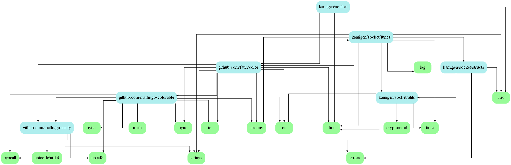

# Defrag TCP Socket Golang


## Installation

If you have already installed golang, you can skip this step. \
Install golang : https://go.dev/dl/ \
Add go to PATH : https://golang.org/doc/install/source#environment

```bash
git clone https://github.com/Edouard127/DefragTCPSocket.git
cd DefragTCPSocket
go build .
```


## Features

- Multi-worker support
- Get screenshot from the workers
- Login & Logout from servers
- Password secured connections
- Baritone & Lambda commands
- HighwayTools support
- Send messages to servers


## FAQ

#### Can my workers be hijacked?

If you use a strong password, or the default randomly generated password, it is very unlikely that your workers will be intercepted by others.

#### Why my game is crashing ?

Probably because kotlin & java are not my preferred language & not the one I know the most

#### Why my server is crashing ?

Because I started using golang 2 days ago :trollface:


## Useful information

#### Data transfers

Data sent through the socket is sent to each worker connected to the socket.
The data sent is a encoded struct of ClientCommand:

```go
type ClientCommand struct {
	Command string
	Data    [][]byte
}
```

Since the server do not know where the data should be delivered, you need to provide a flag which tells the server where the data should be sent.
```go
var Flags = map[string]byte{
	"SERVER": 0x00, // Server
	"CLIENT": 0x01, // Listeners
	"GAME":   0x02, // Workers
	"BOTH":   0x03, // CLIENT & GAME
}
```


#### Register a new worker

```go
type Client struct {
	// The name of the client.
	Name    string
	// The connection to the client.
	Conn    net.Conn
	// The password of the client.
	Password string
}
```


Packets:

```go
var Packets = map[string]byte{
"EXIT":            0x00, // user->server->client Notifies the client that the server is closing the connection.
"OK":              0x01, // client<->server Notifies the client that the server is ready to receive the next packet.
"HEARTBEAT":       0x02, // client<->server Ping packet.
"LOGIN":           0x03, // user->server<->client Notifies the server that the client is trying to log in.
"LOGOUT":          0x04, // user->server<->client Notifies the server that the client is trying to log out.
"ADD_WORKER":      0x05, // user<->server Notifies the server of a new worker.
"REMOVE_WORKER":   0x06, // user<->server Notifies the server that a worker has been removed.
"GET_WORKERS":     0x07, // user<->server<->client Notifies the server that the user wants to get the list of workers.
"JOB":             0x08, // user<->server<->client Notifies the server that the user wants to get the status of a worker.
"CHAT":            0x09, // user->server<->client Notifies the server that the user wants to send a chat message.
"BARITONE":        0x0A, // user->server<->client Notifies the server that the user wants to send a baritone command.
"LAMBDA":          0x0B, // user->server<->client Notifies the server that the user wants to send a lambda command.
"ERROR":           0x0C, // client<->server<->user Notifies the user that the server or the client has encountered an error.
"LISTENER_ADD":    0x0D, // user<->server Notifies the server that a listener has been added.
"LISTENER_REMOVE": 0x0E, // user<->server Notifies the server that a listener has been removed.
"HIGHWAY_TOOLS":   0x0F, // user<->server<->client Notifies the server that the user wants to send a highwaytools command.
"SCREENSHOT":      0x10, // user<->server<->client Notifies the server that the user wants to get a screenshot.
"GET_JOBS":        0x11, // user<->server<->client Notifies the server that the user wants to get the list of jobs.
}
```


#### Protocol

Each packet sent must match the hardcoded protocol, a documentation will soon be available

```
[Length] [Fragmented] [Packet] [Flag] [Worker] [Password] [Data]
```


## Examples

Using the client.js

```bash
node client.js

10 0 9 2 Kamigen password Hello Chat
```

Dev Video: https://youtu.be/j80Uqv2IxQI

Video: SOON

Packages graph:



