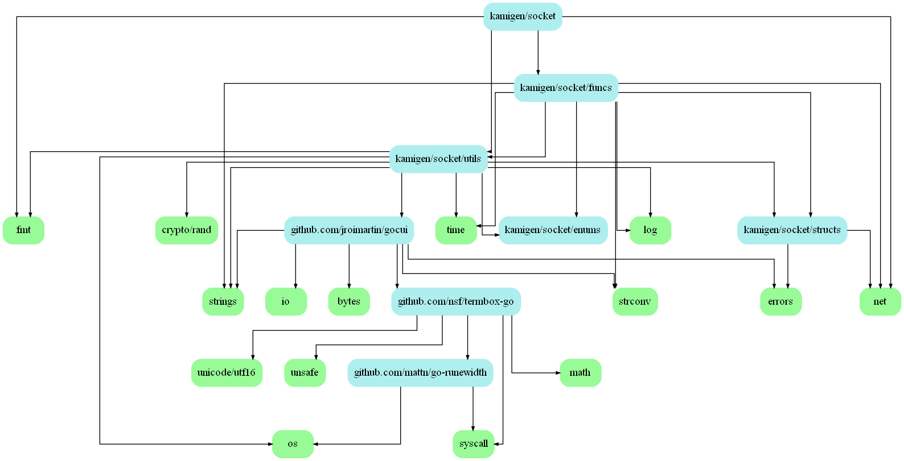

# Lambda Remote Control Socket

A few months ago, I needed a simple solution to build highways on anarchy Minecraft servers.

Despite my short research, I didn't find anything, so...

I decided to make something useful for more than one person.


## Badges
[](https://go.dev/)\
[](https://discord.gg/J23U4YEaAr)


## [Plugin repository](https://github.com/Edouard127/LambdaRemoteControl)

## Features

- Multi-worker support
- WIP Get screenshot from the workers
- Login & Logout from servers
- Password secured connections
- Baritone & Lambda commands
- HighwayTools support

## FAQ

#### Can my workers be hijacked?

If you use a strong password, or the default randomly generated password, it is very unlikely that your workers will be intercepted by others.

## Installation

If you have already installed golang, you can skip this step. \
[Download](https://go.dev/dl/) \
[Add to PATH](https://golang.org/doc/install/source#environment)

```bash
git clone https://github.com/Edouard127/DefragTCPSocket.git
cd DefragTCPSocket
go build .
```
## Documentation

#### Requests

Any packet sent must have this:

- TOTAL length of the packet (including the header)
- Fragmentation byte: 0 or 1 (0 if the packet is not fragmented)
- Packet byte (0x00 for exit etc)
- Flag byte (0x02 for workers, 0x01 for listeners etc)
- Args (array of arrays of bytes)* <br />

*`*` Means that It is optional*

```go
type ClientCommand struct {
	// The length of the command.
	Length byte
	// Fragmentation byte.
	Fragmented byte
	// The byte of the command.
	Byte byte
	// The flags of the command.
	Flag byte
	// The arguments of the command.
	Args [][]byte
}
```

#### Destination Flags
```go
var Flags = map[string]byte{
	"SERVER": 0x00, // Server
	"CLIENT": 0x01, // Listeners
	"GAME":   0x02, // Workers
	"BOTH":   0x03, // CLIENT & GAME
}
```

#### Commands
The commands are arrays of bytes <br />
They are at index 4 of the packet 

#### Exit
WIP <br />
The exit command will emit a `EXIT` signal to all the workers. <br />
It will also close the socket.

#### Ok
The ok packet usually means that the command has successfully run, but there was no return value. <br />

#### Heartbeat
The heartbeat packet is sent every 5 seconds to the workers. <br />
It is used to keep the connection alive.
If the worker does not respond in the deadline, it will be disconnected.

#### Login
The login packet is to make a worker connect to a server. <br />
It is sent to the server with the following arguments:
- The name (random string)
- The server (IP/domain)
- LAN (true or false)

#### Logout
The logout packet is to make a worker disconnect from a server. <br />

#### Add Worker
The add worker packet is to add a worker to the worker array. <br />
It is sent to the server with the following arguments:
- The username (username of the worker)
- The password (password of the worker)

#### Remove Worker
The remove worker packet is to remove a worker from the worker array. <br />
It is sent to the server with the following arguments:
- The username (username of the worker)
- The password (password of the worker)

#### Information
The information packet is to get information about a worker. <br />
The response is a string of:
- The player
- The health
- The food level
- The number of players in render distance
- Coordinates
- Main hand item
- Offhand item
- Sprinting? If true
- Sneaking? If true
- The player inventory
- Armor? If it has any
- Server data (Players, max players) or "No server data"

#### Job
The job packet is to get the job of a worker. <br />
The response is a string of:
- Job type
- Status
- Goal
- Player name
- Current position (If the job isn't scheduled)

A job will emit his status when one of these events:
- JobEvent
- StartPathingEvent
- StopPathingEvent
- UpdatePathingEvent

Is emitted

If the worker is stuck, the game will send emit an event with the `JOB_STUCK` byte. <br />

Worker type:
```kotlin
enum class EWorkerType(val byte: Int) {
    HIGHWAY(byte = 0x00),
    BARITONE(byte = 0x01),
}
```
Worker status
```kotlin
enum class EWorkerStatus(val byte: Byte) {
    BUSY(byte = 0x00),
    IDLE(byte = 0x01),
}
```

Job events:
```kotlin
enum class EJobEvents(val byte: Int) {
    JOB_STARTED(byte = 0x00),
    JOB_FINISHED(byte = 0x01),
    JOB_FAILED(byte = 0x02),
    JOB_PAUSED(byte = 0x03),
    JOB_RESUMED(byte = 0x04),
    JOB_CANCELLED(byte = 0x05),
    JOB_SCHEDULED(byte = 0x06),
    JOB_STUCK(byte = 0x07),
}
```

#### Chat
The chat packet is to send a message in the current server of the worker. <br />
It is sent to the server with the following arguments:
- The message

#### Baritone
The baritone packet is to send a baritone command. <br />
It is sent to the server with the following arguments:
- The command

This will trigger the `JobEvent` and `StartPathingEvent` events.

At every tick, the `UpdatePathingEvent` event will be emitted.

Once the job is finished, the `StopPathingEvent` event will be emitted, and the job will be ended.

#### Lambda
The lambda packet is to send a lambda command. <br />
It is sent to the server with the following arguments:
- The command

#### Error
The error packet is used to report a server or client error. <br />

#### Listener add
The listener add packet is to add a listener to the listener array. <br />

At every command that has the destination flag 1, the listeners will receive the packet.

#### Listener remove
The listener remove packet is to remove a listener from the listener array. <br />

#### HighwayTools
The [HighwayTools](https://github.com/lambda-plugins/HighwayTools) packet is to create a HighwayTools job. <br />
It is sent to the server with the following arguments:
- The parameters byte
- The parameters value

This will trigger the same events as the baritone packet.

#### Screenshot
WIP
The screenshot packet is to get a screenshot of the worker game. <br />
The response is multiple packets of the PNG buffer in a string. <br />

#### Get Jobs
The get jobs packet is to get the jobs of the worker. <br />

#### Rotate
The rotate packet is to rotate the worker head position. <br />
It is sent to the server with the following arguments:
- The yaw (NORTH, SOUTH, EAST, WEST)
- The pitch (UP, DOWN, HORIZONTAL)

*Take note that those format can change at any moments*


```go
var Packets = map[string]byte{
	"EXIT":            0x00, // user->server->client Notifies the client that the server is closing the connection.
	"OK":              0x01, // client<->server Notifies the client that the server is ready to receive the next packet.
	"HEARTBEAT":       0x02, // client<->server Ping packet.
	"LOGIN":           0x03, // user->server<->client Notifies the server that the client is trying to log in.
	"LOGOUT":          0x04, // user->server<->client Notifies the server that the client is trying to log out.
	"ADD_WORKER":      0x05, // user<->server Notifies the server of a new worker.
	"REMOVE_WORKER":   0x06, // user<->server Notifies the server that a worker has been removed.
	"INFORMATIONS":    0x07, // user<->server<->client Notifies the server that the user wants to get the information of a worker.
	"JOB":             0x08, // user<->server<->client Notifies the server that the user wants to get the status of a worker.
	"CHAT":            0x09, // user->server<->client Notifies the server that the user wants to send a chat message.
	"BARITONE":        0x0A, // user->server<->client Notifies the server that the user wants to send a baritone command.
	"LAMBDA":          0x0B, // user->server<->client Notifies the server that the user wants to send a lambda command.
	"ERROR":           0x0C, // client<->server<->user Notifies the user that the server or the client has encountered an error.
	"LISTENER_ADD":    0x0D, // user<->server Notifies the server that a listener has been added.
	"LISTENER_REMOVE": 0x0E, // user<->server Notifies the server that a listener has been removed.
	"HIGHWAY_TOOLS":   0x0F, // user<->server<->client Notifies the server that the user wants to send a highwaytools command.
	"SCREENSHOT":      0x10, // user<->server<->client Notifies the server that the user wants to get a screenshot.
	"GET_JOBS":        0x11, // user<->server<->client Notifies the server that the user wants to get the list of jobs.
	"ROTATE":          0x12, // user<->server<->client Rotates the worker head position.
}
```
*Take note that the format can change at any moments*

## Credits
Thanks to the [Lambda](https://github.com/lambda-client/lambda) contributors for the API. <br />
Thanks to [Avanatiker](https://github.com/Avanatiker) for the [HighwayTools](https://github.com/lambda-plugins/HighwayTools) plugin. (please fix all the small issues with it) <br />
Thanks to [Guillaume](https://github.com/GuillaumeOuint) for showing me how great Golang is. <br />

Latest dev footage: [Video](https://youtu.be/j80Uqv2IxQI)


Packages graph:



